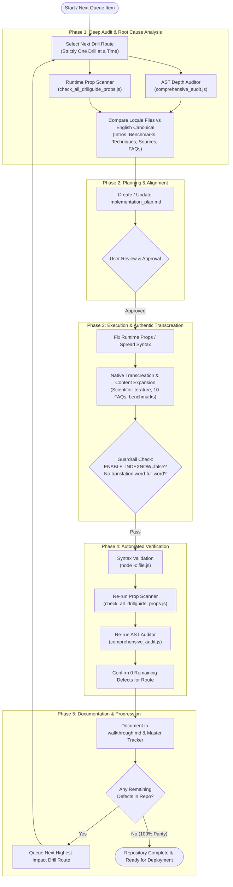

# SkillDrills Localization & Content Depth Workflow

## 1. End-to-End One Drill Resolution Pipeline

---

## 2. Priority Queue & Current Progress Status

```mermaid
flowchart LR
    subgraph Done["COMPLETED"]
        D1["memory/working-memory/n-back<br/>(18 defects resolved across 6 locales)"]
    end

    subgraph Active["CURRENT TARGET"]
        D2["reaction-speed/fps-tracking-trainer<br/>(Fix scientificIntro prop & 4th protocol)"]
    end

    subgraph Queue1["NEXT IN LINE"]
        D3["Broken pickSources Keys<br/>(5 routes / 7 files)"]
    end

    subgraph Queue2["QUEUED"]
        D4["French Missing Techniques<br/>(4 spatial & focus routes)"]
        D5["Remaining Trimmed Intros & Depth<br/>(Iterative single-drill resolution)"]
    end

    subgraph Final["FINAL GATE"]
        D6["Full Repo Validation<br/>(0 defects across all 545 pages)"]
    end

    Done --> Active --> Queue1 --> Queue2 --> Final

    classDef doneStyle fill:#0d532b,stroke:#27ae60,stroke-width:2px,color:#fff;
    classDef activeStyle fill:#7a4b04,stroke:#f39c12,stroke-width:2px,color:#fff;
    classDef queueStyle fill:#1a252f,stroke:#34495e,stroke-width:1px,color:#ddd;
    classDef finalStyle fill:#162447,stroke:#1f4068,stroke-width:2px,color:#fff;

    class D1 doneStyle;
    class D2 activeStyle;
    class D3,D4,D5 queueStyle;
    class D6 finalStyle;
```

---

## 3. Core Quality Gates Per Drill

| Gate | Criterion | Tool / Verification | Status Rule |
| :--- | :--- | :--- | :--- |
| **G1: Runtime Props** | Zero silently dropped props (`lead`, `scientificIntro`) | `check_all_drillguide_props.js` | Must be 0 |
| **G2: Content Depth** | 5 intro paragraphs, 5 benchmark rows, 4+ protocols, 10 FAQs | `comprehensive_audit.js` | 100% match with English |
| **G3: Citations** | Valid keys in `pickSources(...)` | Runtime test against `lib/drillSources.js` | Non-empty array returned |
| **G4: Syntax** | Valid JS / JSX syntax | `node -c <file.js>` | Exit code 0 |
| **G5: Guardrail** | Zero IndexNow / Bing API pings | Environment check | `ENABLE_INDEXNOW=true` strictly forbidden |
